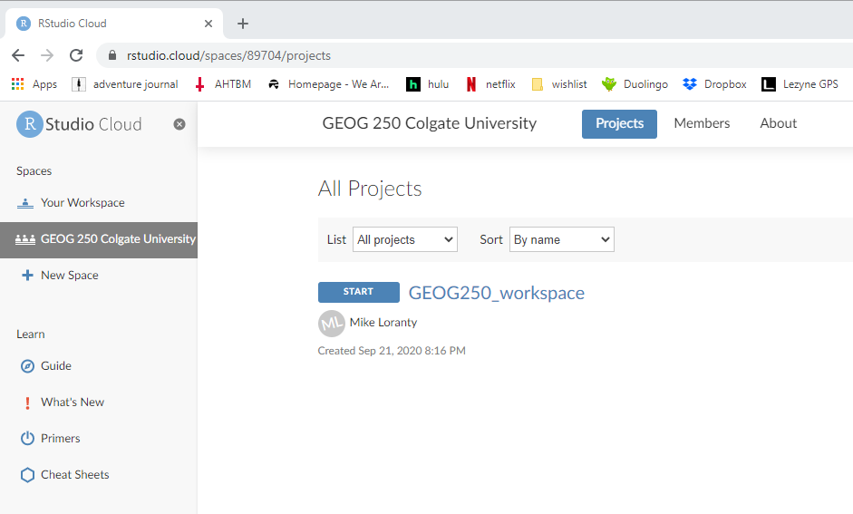
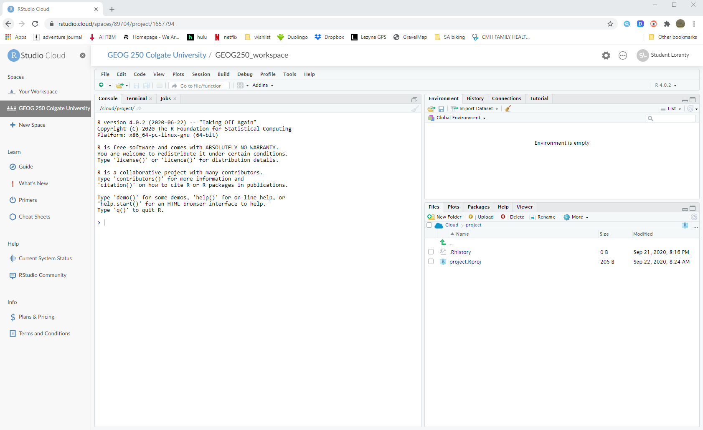
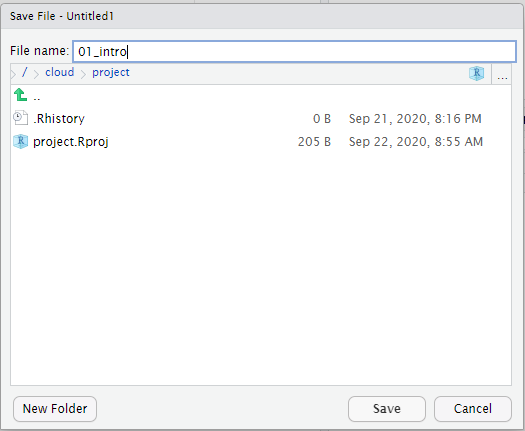

```{r setup, include=FALSE}
knitr::opts_chunk$set(echo = TRUE)
knitr::include_graphics
library(imager)
```
#### _GEOG 250: Research Methods in Geography, Colgate University_

## Learning objectives
#### 1. Learn to use RStudio Cloud
#### 2. Introduction to R 
#### 3. Handling data in R


## Introduction to R & RStudio Cloud
R is a powerful set of tools for manipulating, analyzing, and visualizing data. These tools are open source, which means that they are and always will be free to use, and they are developed by a worldwide community of users. The R programming language is at the core of these tools. Using the R language you can write commands that will tell your computer what you want it to do with your data. While this may seem a bit daunting there are a number of advantages associated with using tools like R to work with data, instead of using spreadsheet programs where you point and click, for example. In particular you can perform complex calculations with large amounts of data very quickly, and more importantly you can save a record of your commands to make everything you do transparent and reproducible. This is very important in science! 

For our class we are going to use RStudio Cloud to access R. RStudio is something we call an Integrated Development Environment, or IDE for short. It is important to remember that R is the programming language and computer platform, you can use R by itself, but you cannot use RStudio without R. RStudio is simply a nicer interface for interacting with R that includes handy features for keeping your work space organized. As you might have guessed, there is a desktop version of RStudio you can install on your computer, or a cloud-based version that we'll be using. Let's get started. 

This semester we will use a shared work space that I've created for our class. Click the link I've shared with you to join our class work space. You should see something like this: 

<br/>
<center>

</center>  
<br/>

Click the **START** button to create a copy of the project for yourself. It might take a moment to load the project, and then you will see the RStudio IDE. 

<br/>
<center>

</center>  
<br/>

There are a few important things to point out here. On the left side of the window you will see the **Console**. This is where we type commands that tell R what to do. In the upper right is the **Environment**. Once we start working with different data it will appear here. In the bottom right is the **Files** window. It only has some basic files associated with our project, but as we add data, scripts, and create graphs they will appear here. Notice in all of these panes there are tabs at the top that allow to see other important things as well. We'll learn more about these a little later. 

## Using R to create and manipulate data
Let’s get a feel for how R works more. Since R is just like a sophisticated calculator, you can type in numerical operations and will get the calculations as output. Type a few different operations like the one below. Note I’ve included both the code and outputs here for an example.


```{r pressure, echo=TRUE}
# remember that this is a comment that R will ignore
# it's extremely important to use comments for documenting your code and writing notes
# let's calculate 6 raised to the 6 power
6^6
```

```{r}
#234 + 8
234+8
```

```{r}
#15-23
15-23
```

Because R is a programming language, we need to learn its syntax in order for the computer to understand us. For example try entering the following two pieces of code.

```{r,message=F, error=T}
# if you enter an incomplete command R will show '+' until you finish it
5-
  
# R will give you an error message if it doesn't understand the command you've entered
3 % 5 
```


There’s a few things to pay attention to in the console. The > symbol always indicates a new line of code. The + symbol means your line is continuing. Your results will have numbers in brackets to describe the output. [1] Means I have a vector and my output starts on the first element of my vector (in this case its a vector of one).

You can also create **objects** with assigned names. Below is an example where I know I will want to use the number 2446 many times so I will give it a shorter name. R conducts all operations on that number. The <- symbol means you are assigning an **object** a **variable name**.

```{r}
# name my number
a <- 6234
# multiply my number by 5
a*5
```

```{r}
# divide my number by 3
a/3
```

In data can be stored in a **vector**, which is a sequence of data elements with the same basic type. We will talk about data types more letter, so for now let's just think of data as numbers. R automatically does vector operations, meaning that you can assign two numbers to a variable name and do math operations on them. First you have to let R know you are making a vector of multiple numbers using c(,…,)


```{r}
# make a vector of numbers
b <- c(2395,82,2947)
#divide all numbers by 2
b/2
```

## Scripts
We can use an R script to keep a record of our calculations and any other things we do with our data in R. A script is essentially a text file with a record all of our commands in it. In an R script a hashtag `#` tells R to ignore that particular line. This is called **commenting**, and it is useful for leaving notes for yourself and others in your script. In fact, commenting is an important aspect of reproducibility, and **you will be graded on how well your code is commented**.

To make a script in RStudio click on File > New File > R Script. By default this will open in the upper left corner of RStudio, above the console. Before we do anything, save your script you your project directory with the file name **01_intro**. Why do we choose this filename? 

<br/>
<center>

</center>  
<br/>

Now you can type commands in your script and have a record of what we are doing. Try typing a command - what happens? Note that commands will not execute after you hit enter, instead your cursor will just go to the next line. There are a few ways to execute commands in a script. You can press the `Run` button in the upper right of your script window, press CTRL ENTER - either of these options will execute only the line that your cursor is on. You can highlight multiple lines, and use either of these methods to execute them. Pressing the `Source` button will run every command in your script. 


<center>
```{r echo=FALSE, warning=FALSE,fig.width=8,fig.height=1.5}
par(bg = rgb(238/255,243/255,250/255), mai=c(0,0,0,6.75))
plot(load.image("images/Leaf2.PNG"),   axes=FALSE)
a <- strwrap("Practice writing mathematical operations and making vectors using variable names in R. In your script write 3 calculations that use vectors with at least four numbers and a variable name. Run them to make sure they work.",width=70)
text(800,75, "Code Challenge 1:", font=2, xpd=T, cex=1.25,adj = c(0,0))
for(i in 1:length(a)){
  text(800,75+(i*175),paste(a[i]), xpd=T, cex=1.25,adj = c(0,0))
}
```
</center>
<br/>

## More on working with data in R
### _Vectors_
Common types of objects in R include vectors, matrices, and dataframes. Last class, we briefly learned about creating vectors in R. You assign a name to an object using the arrow: **<-** and can make a vector using **c()**. If you remember, R is vectorized so we can automatically apply vector or matrix math to an object. Running the name of an object will print out the object.
```{r echo=TRUE}
#make a vector of tree heights in meters
heights <- c(30,41,20,22)
#convert to cm
heights_cm <- heights*100
heights_cm
```
R uses a very specific notation around vectors. It is helpful for subsetting. Anytime you see square brackets **[ ]** recognize that this is subsetting an object in R. Also note that R always counts starting at one (no zeros like other programming languages!). Whenever you see a colon **:**, know that you are indexing through multiple values.
```{r echo=TRUE}
#look at the first tree height
heights[1]
#look at the 2nd and 3rd tree heights
heights[2:3]
```
### _Matrices_
I like to think of matrices as essentially multiple columns of vectors in R. You can set up a matrix using the _matrix()_ function. **Functions** are built in to R and will always have parenthesis **()** following the function name. Anything inside of the parentheses is called an **argument**. Here to build a matrix, you need a vector of numbers that fills in the matrix and specify the number of columns or rows. You can also specify how to fill in the matrix (do you go through all columns in each row?). If you ever aren't sure of arguments for a function, you can use _help_ or _?_. 

```{r echo=TRUE}
#get more info on the matrix function
help(matrix)
```

Now, let's make some example matrices. Note the differences in filling in by column vs row.
```{r echo=TRUE}
#set up a matrix with 2 columns and fill in by rows
#first argument is the vector of numbers to fill in the matrix
Mat<-matrix(c(1,2,3,4,5,6), ncol=2, byrow=TRUE)
Mat
#set up a matrix that fills in by columns
#first argument is the vector of numbers to fill in the matrix
Mat.bycol<-matrix(c(1,2,3,4,5,6), ncol=2, byrow=FALSE)
Mat.bycol
```
Notice when the both the matrices are run, the output now has square bracket labels with two spots. This notation will always be formatted **[row,column]**. You can use this notation to refer to specific spots in a matrix using the name of the matrix.

```{r echo=TRUE}
#subset the matrix to look at row 1, column2
Mat.bycol[1,2]

```
An opening in a square bracket after or before a comma means refer to all items in that slot. You'll notice the output is a vector when subsetting. 

```{r echo=TRUE}
#look at all values in row 1
Mat.bycol[1,]
#look at all values in column 2
Mat.bycol[,2]
```

### _Functions in R_
There are a wide variety of functions available to use in R. Functions generally perform some sort of mathematical operation, and can be fairly sophisticated. Functions are followed by parentheses, and you typically write and **argument** inside the parentheses. For example, imagine that we have a vector of numbers from 1 to 6, and we want to find the mean of these numbers. It turns out there is a `mean` function, and if we supply our vector as the argument R will calculate the mean of all numbers in the vector.

```{r, collapse = T}
mean(1:6)

```

This is convenient, but you may be asking how do I know what functions exist and what the arguments are? For that we can use the help function in R. If you know which function you want to use you can see the documentation in the help window by typing a question mark followed by the function name in the console.  
```{r, evaluate = F}
?round
```

### _Reading data from a file_
Most data that you will work with is too large to be typed into R scripts. A lot of the data will be available in spreadsheet or text file format. You will want to work with this type of data as a dataframe. Dataframes are are matrices where columns have names and rows contain observations for the same entity. This works a lot like a spreadsheet, but we can apply our vector and matrix utilities in R. For example, we will read in a data file for weather data where columns contain data for temperature and precipitation, and each row has an observation for the same day and weather station. You may be used to working with data in excel spreadsheets with a .xlsx extension that is proprietary to Microsoft. This is not ideal to work with, and we will work with **.csv (comma separated values file)**. This file contains the text version of an excel spreadsheet where the values for each cell are included in the file and the designation of a new cell starts with a comma. You can always resave an .xlsx file as a .csv. Let's read in a file. 


To begin, in your file window, click the *New Folder* icon and create a new folder named *data*. Next, click the *upload* button, and then the *Choose File* button, and navigate to the *thaw_depth.csv* file that I sent you.  
 
We can use the `read.csv()` function to read in data files that are in *csv* format. (Note that we can use the `read.table()` function to read other types of files. All of these functions require the the file name as an argument. Here we have to tell R that it is located within the *data* folder in my working directory.

```{r, message = T,error = T, echo = T}
thaw <- read.csv("data/thaw_depth.csv")
```


Use the help function to find out what additional arguments you might use with the `read.csv` function. 


We can use the `head` and `tail` functions to look at the first and last few rows of this dataset, respectively. 
```{r,message = T}
head(thaw)

tail(thaw)
```

We can use matrix notation to access data elements within an object: td[row,column] 
```{r,message = T}
# What is the value in the row 1 column 1
thaw[1,1]

# Or the values in rows 1-5 of column 5
thaw[1:5,5]
```

Notice here that we have different types of data. Data in the first column is text-based, while the fifth column is numeric. It turns out our data stored as a special kind of matrix called a `dataframe`. We can get some more information about it using the `str()` function. 
```{r, message = T}
str(thaw)
```

There are a couple of important things to note here. The first is that with a data frame we can have different types of data. For example try converting our td data frame to a matrix using the `as.matrix()` function. What happens when you do this? Why do you think that is? 
```{r, message = T, eval = F}
as.matrix(thaw)
```


Second, you can access variables, or columns within a data frame using the following syntax. 
```{r, message = T}
thaw$td
```

Another handy thing that R can do is evaluate logical statements. For example, what happens when we look for thaw depths that are less than 50?  
```{r, message = T, eval = F}
thaw$td<50
```
What does this output mean? 

What happens when we put this logical statement inside matrix notation? 
```{r, message = T, eval = F}
thaw[thaw$td<50,]
```

Here is a list of logical operators in R.

      <   less than
      <=  less than or equal to
      >   greater than 
      >=  greater than or equal to
      ==  exactly equal to
      !=  not equal to
      !x  not x 
      x|y x or y
      x&y x and y
      
  <center>
```{r echo=FALSE, warning=FALSE,fig.width=8,fig.height=1.5}
par(bg = rgb(238/255,243/255,250/255), mai=c(0,0,0,6.75))
plot(load.image("images/Leaf2.PNG"),   axes=FALSE)
a <- strwrap("Calculate the mean thaw depth for each transect in our data frame. (Hint use the 'unique' function to find out about transects)",width=70)
text(800,75, "Code Challenge 2:", font=2, xpd=T, cex=1.25,adj = c(0,0))
for(i in 1:length(a)){
  text(800,75+(i*175),paste(a[i]), xpd=T, cex=1.25,adj = c(0,0))
}
```
</center>
<br/>
