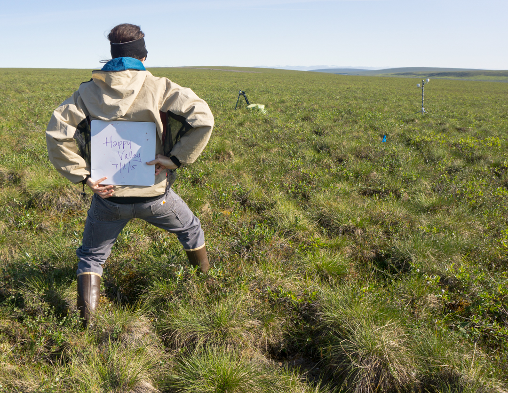

```{r setup, include=FALSE}
knitr::opts_chunk$set(echo = TRUE)
#knitr::opts_chunk$set(root.dir = "Z:/Geog250_F19/loranty/")
```

This week we are going to continue working with our field data from Siberia. Specifically, we are going to be thinking about different types of data, statistical distributions, and probabilities. We'll need to be familiar with these concepts in order to perform stastical hypothesis tests in the coming weeks. 

To begin, let's create a new script, fill in the appropriate header information, and set our working directory.
```{r,collapse = T, eval=F}
#####################
# probability script
# GEOG250 F19
# MML 10/22/19
#####################

# set working directory to my folder on the server
setwd("Z:/Geog250_F19/loranty/")

# remember that you should be writing good descriptive comments here - these are your notes!

```

As we begin to think more deeply about our data it is worth noting the different between *discrete* and *continuous* variables. What is the difference between these two types of data? Can you think of representative examples from the data we used last class?

## 1. Discrete Probaiblity Distributions

There happens to be a discrete variable in our thaw depth data set. Let's read it in and have a look. Which variable in this data set is discrete?

```{r, message = T,error = T, echo = T}
thaw <- read.csv("data/thaw_depth.csv")
```

You may realize that our disctrete variable only occurs at one field site represented in this data set (wws), so before we can go further we need to create a subset. Let's do that now using matrix notation and the `site` variable in a logical statement. Define your data subset as an object called `w.thaw`

```{r, message = T, eval = T,echo = F}
w.thaw <- thaw[thaw$site=="wws",]
```

For the sake of simplicity let's assume that our variable, `tussock`, which indicates the presence or absence of a tussock at our sampling location, has a probability of 0.5 for either outcome. In this case we are interested in knowing where there are tussocks co-located with our thaw depth measurments along the sampling transects. You can see in the photo below that tussocks create an accumulation of soil that sits above the surrounding vegetation, and might affect our measurments.

{width=400px}


{width=400px}

If we assume that the probability (*p*) of tussock occurence is constant, and that tussocks occur independently of each other then tussock is a *binomial variable* that describes a *binomial process*. Subsequently our data can be described using a binomial distribution, which we can use to find the probability that particular outcomes will occur. We'll not go through the mathematics of these calculations here, but you should know that in order to determine the probability of a *random variable* or particular outcome (e.g. have 25 tussocks) we need to know only the total number of independent trials (*n*) and the equal probability of success (*p*) for each outcome. So in our case we want to know the likelihood of 25 tussocks given *p* = 0.5 and *n* = 101. Here we can use the `dbinom` function in R to compute this probability as follows. 

```{r, message = T,error = T, echo = T}
dbinom(25,101,0.5)
```

In this case the probability that we will have 25 out 101 measurements with tussocks is quite low, which makes sense. Given the probability of 0.5, so our *expected value* or *theoretical mean* would be 101 x 0.5, or 50.5. 

Calculate the probability of having 50 tussocks out of 101 measurments.What is the answer? 
```{r, message = T,error = T, echo = F, eval = F}
dbinom(50,101,0.5)
```
We can also use the the `rbinom` to create a random data set with our distribution, and plot this as a histogram. 
```{r, message = T,error = T, echo = T, eval = T}
hist(rbinom(101,101,0.5),breaks = 1:100,
     xlab = "Tussock Presence",main="")

lines(1:101,dbinom(1:101,101,0.5)*101)
```

See if you can modify the code above to create a graph Like the one below that includes sample histograms for *p* = 0.25 and *p* = 0.75. 

```{r, message = T,error = T, echo = F, eval = T}
hist(rbinom(101,101,0.5),breaks = 1:100,probability = T,
     xlab = "Tussock Presence",main="")
hist(rbinom(101,101,0.25),breaks = 1:100,probability = T,
     col="red",add=T)
hist(rbinom(101,101,0.75),breaks = 1:100,probability = T,
     col="blue",add=T)
```

Related to this, we can use the *geometric distribution* to estimate how far along our measurement transect we might go before encountering a tussock. Here our random variable (*X*) indicates the number of failures before the first success (tussock) occurs. For example, how likely is it that there are no tussocks until the eleventh measurement? We can calculate this using the `dgeom` function. 

```{r, message = T,error = T, echo = T}
dgeom(10,0.5)
```

We can even plot this too.

```{r, message = T,error = T, echo = F, eval = T}
plot(1:10,dgeom(1:10,0.5),
     type="l",ylim = c(0,0.3),
     xlab = "Measurements Until First Tussock",
     ylab = "Probability")
lines(1:10,dgeom(1:10,0.25), col="red")
lines(1:10,dgeom(1:10,0.75), col="blue")
```

This may seem like a silly example, but on the other hand, it may be useful to know how far you can walk before worrying about the possibility of tripping over a tussock. In this case it is not very far. 

The binomial and geometric distributions become much more useful however, when considering data related to the probability of environmental events such as floods or wildfires. While we know a great deal about the atmospheric and hydrological processes underpinning these types of events, they are difficult to predict on relatively long timescales. By looking using the frequency of occurence as a probability, we can calculate the likelihood of these types of events. This information in turn is useful for a wide range of planning purposes. 

## 2. Continuous Probability Distributions

As we noted above, continuous random variables can assume an infinite number of values. Here, we will use different set of probability distributions to describe these variables. 

The *uniform* distribution is the simplest continuous probability distribution. This is the case where all values are equally likely. For example, imagine a case where we are measuring water temperature in degrees Farenheit, and any value between 35 and 55 degrees is equally likely. 

```{r, message = T,error = T, echo = F, eval = T}
hist(36:55,breaks = 35:55,probability = T,col = "gray80",
     xlab = "Number of Leaves",main="")
```

Another useful visualization, especially for continuous probability distributions, is to plot the cumulative frequency. 

```{r, message = T,error = T, echo = F, eval = T}
plot(c(35,55),c(0,1),
     type = "l",lwd=2,
     xlim = c(30,60),
     ylim= c(0,1.19),
     xlab = expression(paste("Water Temperature (",degree*F,")",sep="")),
     ylab = "Cumulative Probability")
```

What does this graph mean, how do you interpret this? 


Now let's look at the normal distribution. This will likely be familiar to you as the *bell curve* and can be described in terms of a sample mean and standard deviation. You may be used to seeing the standard normal distribution with a sample mean of 0, and standard deviation of 1. The area under this curve is equal to one, and so if we want to find the probability for a value or range of values we must calculate that area. The mathematics here are a little more complex, and so we typically use *z-scores* to do this, as out book mentions. 

```{r, message = T,error = T, echo = t, eval = T}

plot(seq(-3,3,0.1),dnorm(seq(-3,3,0.1),0,1),
     xlab = "",ylab = "Probability", type = "l", lwd = 2)
```

We'll think more about *z-scores* in the coming weeks. But for now let's return to our thaw depth data set. As we did last week, we can plot a histogram of thaw depth. But this time, let's also plot a probability curve on top of this. 

```{r, message = T,error = T, echo = F, eval = T}
hist(thaw$td,probability = T,
     xlim = c(0,100),main="",
     xlab = "Thaw Depth (cm)")
lines(1:100,dnorm(1:100,mean(thaw$td),sd(thaw$td)))
```

Do you think it looks as though our data are normally distributed? For the remainder of class, your task is to choose three variables, in three separate data files, and plot the histogram with a standard normal distribution on top of it, like the plot above. 
