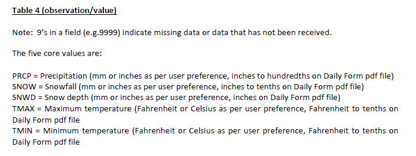
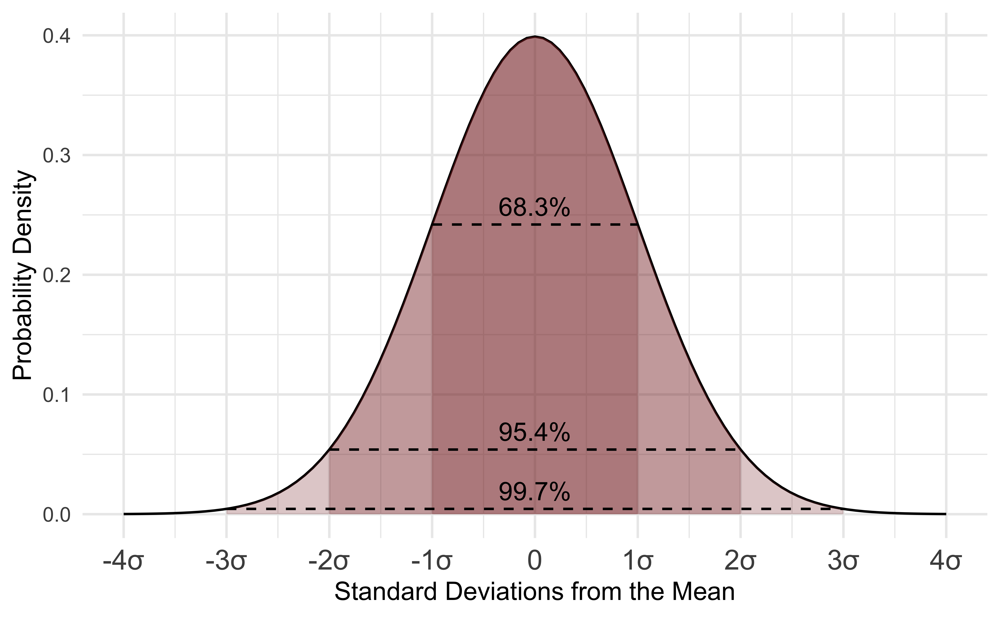

#### _GEOG 331: Environmental Data Science, Colgate University_
## Instructions
There are 10 questions to this activity. Save your answers in word document that you will hand in on Moodle using a .pdf extension. Keep your script file in your GitHub folder and make sure that all changes are pushed to GitHub. Code for all questions should be clearly commented with the question number. You will include a link to your script file as a part of your final question in this activity. The assignment is worth 30 points.

I will provide a lot of code examples as a part of this Activity. As the course progresses, I will gradually provide less code. You will have to adapt this code in the questions. To do this successfully, you will likely  need to refer to R documentation and online resources to thoroughly understand all parts of the code. Troubleshooting and learning to interpret code is a huge part of learning R! It often involves making a lot of mistakes and getting error messages. That's great and normal! I've been working in R for 12 years, and I still generate a lot of mistakes and error messages! You'll just get better at fixing them.

## Learning objectives
#### 1. Handling data in R
#### 2. Intro to probability and summary statistics
#### 3. Characterize weather events

```{r warning=FALSE,echo=FALSE, message=FALSE}
library(imager)
```

## Working with data in R

```{r echo=TRUE}
#get more information about the dataframe
str(datW)

```
In the output, you'll see the number of rows and columns of the data frame in the first line and a preview of the first few rows of data in each preview. You'll notice there are two types of data: **numeric** and **char** or character strings. In the _NAME_ column, you'll see there are 5 unique site names. More on this type of data later. 


Before we go any further, we are going to want to change the date format from a factor so it is a little more useful.
```{r echo=TRUE}
#specify a column with a proper date format
#note the format here dataframe$column
datW$dateF <- as.Date(datW$DATE, "%Y-%m-%d")
#google date formatting in r to find more options and learn more

```
We also will find it helpful to have a year column that is numeric for working with the data. You can use the **format** function. This will output a date formatted to just include year in a character data type. Since this data is simply a numeric date, we will indicate that it should actually be numeric using the as.numeric function. Note how R lets you nest functions here.

```{r echo=TRUE}
#create a date column by reformatting the date to only include years
#and indicating that it should be treated as numeric data
datW$year <- as.numeric(format(datW$dateF,"%Y"))

```

<center>
```{r echo=FALSE, warning=FALSE,fig.width=8,fig.height=1.5}
par(bg = rgb(238/255,243/255,250/255), mai=c(0,0,0,6.75))
plot(load.image("images/Leaf2.PNG"),   axes=FALSE)
a <- strwrap("Using your textbook or online R resources, describe the difference between character, numeric, integer, and factor data. Create an example vector of each data type with five objects in it.",width=70)
text(800,75, "Question 2:", font=2, xpd=T, cex=1.25,adj = c(0,0))
for(i in 1:length(a)){
  text(800,75+(i*175),paste(a[i]), xpd=T, cex=1.25,adj = c(0,0))
}
```
</center>


### _Descriptive Statistics and Histograms_

Let's run some descriptive statistics on the weather data. If you look at the snapshot of the metadata (full file on the server) below, you will find information about the observations in each column. Note that I downloaded with the metric option. 

<center>

</center>

Let's start by looking at the data using some basic summary statistics. The **mean** is a measure of central tendency of our data. You have probably calculated it at some point by adding all of you observations and dividing by the total number of observations. In some fields, this may be referred to as an **average** for samples, and mean may be used more specifically for a probability distribution (more on that later!). There is a built in function in R to calculate a mean. We will also want to calculate the **standard deviation**. This measures the spread of the observations around the mean, and keeps the units the same as the mean. We'll discuss this idea further and cover it in lecture.

Also note that we have data from five sites with very different climates. We will want to describe mean annual patterns separately.

We could start by looking at the mean of a single site using the **mean** function. We can check all site names using the **levels** function. You can subset to a single site by using square brackets and indicating that we want a vector for all _TMAX_ values where the _NAME_ is equal to _ABERDEEN, WA US_. 


```{r echo=TRUE}
#find out all unique site names
unique(datW$NAME)
#look at the mean maximum temperature for Aberdeen
mean(datW$TMAX[datW$NAME == "ABERDEEN, WA US"])

```
You get a NA value here. That's because there is missing data in this data set. NA is a specification that allows you to know that the data is missing and we should not expect a value. NA is handled differently in R and is neither a number or character. Luckily there is an argument in mean that allows us to ignore NAs in the calculation.

```{r echo=TRUE}
#look at the mean maximum temperature for Aberdeen
#with na.rm argument set to true to ingnore NA
mean(datW$TMAX[datW$NAME == "ABERDEEN, WA US"], na.rm=TRUE)
```

Now you will see the average daily maximum temperature in Aberdeen is 14.68 &deg;C. Since this is the average across many decades of observations, this value can help tell us about the climate of the site. Before we move on, average daily temperature is often more helpful  to evaluate temperature. The average is always halfway between the minimum and maximum. We can calculate it as follows:

```{r echo=TRUE}
#calculate the average daily temperature
#This temperature will be halfway between the minimum and maximum temperature
datW$TAVE <- datW$TMIN + ((datW$TMAX-datW$TMIN)/2)
```


The above method of calculating means is not very efficient. However we can use the **aggregate** function to calculate means across and indexing value. 

```{r echo=TRUE}
#get the mean across all sites
#the by function is a list of one or more variables to index over.
#FUN indicates the function we want to use
#if you want to specify any function specific arguments use a comma and add them after the function
#here we want to use the na.rm arguments specific to 
averageTemp <- aggregate(datW$TAVE, by=list(datW$NAME), FUN="mean",na.rm=TRUE)
averageTemp
#change the automatic output of column names to be more meaningful
#note that MAAT is a common abbreviation for Mean Annual Air Temperature
colnames(averageTemp) <- c("NAME","MAAT")
averageTemp
```


The names in this dataset are long. Let's convert the factor data to the underlying numbers to reference them more quickly. You will have to reference the number again for the name.

```{r echo=TRUE}
#convert level to number for factor data type
#you will have to reference the level output or look at the row of data to see the character designation.
datW$siteN <- as.numeric(datW$NAME)
```

Let's take a look at how often different temperature values are observed at each site. You'll use a graphical tool called a histogram. A histogram shows the frequency of temperature observations in different bins.

```{r echo=TRUE}
#make a histogram for the first site in our levels
#main= is the title name argument.
#Here you want to paste the actual name of the factor not the numeric index
#since that will be more meaningful. 
hist(datW$TAVE[datW$siteN == 1],
		freq=FALSE, 
		main = paste(levels(datW$NAME)[1]),
		xlab = "Average daily temperature (degrees C)", 
		ylab="Relative frequency",
		col="grey50",
		border="white")
```


<center>
```{r echo=FALSE, warning=FALSE,fig.width=8,fig.height=1.5}
par(bg = rgb(238/255,243/255,250/255), mai=c(0,0,0,6.75))
plot(load.image("images/Leaf2.PNG"),   axes=FALSE)
a <- strwrap("Using help(hist) and help(paste) look up all of the arguments in my hist function above. Describe what each argument is doing in the hist function above.",width=70)
text(800,75, "Question 3:", font=2, xpd=T, cex=1.25,adj = c(0,0))
for(i in 1:length(a)){
  text(800,75+(i*175),paste(a[i]), xpd=T, cex=1.25,adj = c(0,0))
}
```
</center>


To get a better idea of how the summary statistics describe the data, let's add lines to the plot to designate where the mean and standard deviation are located. Note we'll use the **standard deviation** function. R abbreviates this function name as **sd**. The **abline** function allows us to add lines to a plot. The _v_ argument in this function means add a vertical line. I'll add a red solid line for the mean and red dashed lines for the standard deviation from the mean.

```{r echo=TRUE}
#make a histogram for the first site in our levels, Aberdeen
#main= is the title name argument.
#Here you want to paste the actual name of the factor not the numeric index
#since that will be more meaningful. 
hist(datW$TAVE[datW$siteN == 1],
		freq=FALSE, 
		main = paste(levels(datW$NAME)[1]),
		xlab = "Average daily temperature (degrees C)", 
		ylab="Relative frequency",
		col="grey50",
		border="white")
#add mean line with red (tomato3) color
#and thickness of 3
abline(v = mean(datW$TAVE[datW$siteN == 1],na.rm=TRUE), 
                col = "tomato3",
                lwd = 3)
#add standard deviation line below the mean with red (tomato3) color
#and thickness of 3
abline(v = mean(datW$TAVE[datW$siteN == 1],na.rm=TRUE) - sd(datW$TAVE[datW$siteN == 1],na.rm=TRUE), 
              col = "tomato3", 
              lty = 3,
              lwd = 3)
#add standard deviation line above the mean with red (tomato3) color
#and thickness of 3
abline(v = mean(datW$TAVE[datW$siteN == 1],na.rm=TRUE) + sd(datW$TAVE[datW$siteN == 1],na.rm=TRUE), 
              col = "tomato3", 
              lty = 3,
              lwd = 3)

```

You'll notice that one standard deviation encompasses much of the data. If we went 2 standard deviations out, almost all of the data would be included. 


<center>
```{r echo=FALSE, warning=FALSE,fig.width=8,fig.height=1.8}
par(bg = rgb(238/255,243/255,250/255), mai=c(0,0,0,6.75))
plot(load.image("images/Leaf2.PNG"),   axes=FALSE)
a <- strwrap("Make histograms for at least three other sites' daily average temperature (you choose which sites. Make sure you label the plots and include the mean and standard deviation from the mean. Use different colors for the histogram bars. Add them all into the same window using par(mfrow=c(2,2)) before you run the code that makes all four histograms.",width=70)
text(800,-100, "Question 4:", font=2, xpd=T, cex=1.25,adj = c(0,0))
for(i in 1:length(a)){
  text(800,-100+(i*175),paste(a[i]), xpd=T, cex=1.25,adj = c(0,0))
}
```
</center>

### _Probability distributions_

The data distribution that we just viewed has a very particular shape. Temperature observations are most frequent around the mean and we rarely observe data 2 standard deviations from the mean. The distribution is also symmetrical. We can describe this formally with a **probability distribution**. Probability distributions have a lot of mathematical properties that are useful. We use **parameters** to help describe the shape of how data is distributed. This temperature data follows a **normal distribution**. This type of distribution is very common and relies on **two parameters: the mean and standard deviation** to describe the data distribution. Below is an image of the normal distribution where zero represents the value at the mean of the data and tick marks are designated with standard deviations. 

<center>

</center>


Probability distributions all have functions in R. Below, I show code for using the **dnorm** function to calculate the probability density for a range of temperature values to add to the plot .

```{r echo=TRUE}
#make a histogram for the first site in our levels
#main= is the title name argument.
#Here you want to paste the actual name of the factor not the numeric index
#since that will be more meaningful. 
#note I've named the histogram so I can reference it later
h1 <- hist(datW$TAVE[datW$siteN == 1],
		freq=FALSE, 
		main = paste(levels(datW$NAME)[1]),
		xlab = "Average daily temperature (degrees C)", 
		ylab="Relative frequency",
		col="grey50",
		border="white")
#the seq function generates a sequence of numbers that we can use to plot the normal across the range of temperature values
x.plot <- seq(-10,30, length.out = 100)
#the dnorm function will produce the probability density based on a mean and standard deviation.

 y.plot <-  dnorm(seq(-10,30, length.out = 100),
             mean(datW$TAVE[datW$siteN == 1],na.rm=TRUE),
             sd(datW$TAVE[datW$siteN == 1],na.rm=TRUE))
#create a density that is scaled to fit in the plot  since the density has a different range from the data density.
#!!! this is helpful for putting multiple things on the same plot
#!!! It might seem confusing at first. It means the maximum value of the plot is always the same between the two datasets on the plot. Here both plots share zero as a minimum.
 y.scaled <- (max(h1$density)/max(y.plot)) * y.plot
   
#points function adds points or lines to a graph  
#the first two arguements are the x coordinates and the y coordinates.

points(x.plot,
       y.scaled, 
       type = "l", 
       col = "royalblue3",
       lwd = 4, 
       lty = 2)

```

You can now see the blue dashed line overlaid on the histogram. This is the normal distribution using the mean and standard deviation calculated from the data. You'll notice the normal distribution does a good job of modeling our data. Sometimes it underestimates a data range and at other points it overestimates it, but overall it mirrors the distribution of our data. This means we can rely on properties of the normal to help describe our data statistically!

<center>
```{r echo=FALSE, warning=FALSE,fig.width=8,fig.height=1.8}
par(bg = rgb(238/255,243/255,250/255), mai=c(0,0,0,6.75))
plot(load.image("images/Leaf2.PNG"),   axes=FALSE)
a <- strwrap("Refer to the histograms that you made in question 4. Does daily average air temperature look like it is normally distributed at all sites?",width=70)
text(800,-100, "Question 5:", font=2, xpd=T, cex=1.25,adj = c(0,0))
for(i in 1:length(a)){
  text(800,-100+(i*175),paste(a[i]), xpd=T, cex=1.25,adj = c(0,0))
}
```
</center>


Now let's revisit how we can use probability think about the occurrence of different air temperature ranges. For a given value of the data, the Normal distribution has a probability density associated with observing the value. The probability density doesn't mean anything at a given value of the data. We can't really do anything with that particular number. However, when the normal distribution is integrated across a range of values, it yields a probability for the occurrence of the range of values. For those of you that haven't had calculus, integrating is essentially taking the area under the curve between a range of numbers. We have to keep in mind that the range of the normal distribution extends from -$\infty$ to $\infty$. Let's start by taking a look at all values below freezing in the normal distribution for our Aberdeen weather data. Technically this is the probability of all temperatures below freezing from zero to -$\infty$. Functionally we know some low temperatures would be impossible to observe on earth and the probability of observing values closer to -$\infty$ will be minuscule. Below is a graphical representation of the area of the curve that describes the probability of observing a daily temperature below zero. 

```{r echo=FALSE}
plot(x.plot, y.scaled, type="l",
     main = paste(levels(datW$NAME)[1]),
		xlab = "Average daily temperature (degrees C)", 
		ylab="Relative frequency",col = "royalblue3",
       lwd = 2, lty=2 )
x.sub <- x.plot[x.plot <= 0]
y.sub <- y.plot[x.plot <= 0]
polygon(c(x.sub,rev(x.sub)),
		c(y.sub, rep(0, length(y.sub))), 
		col="tomato2", border =NA)
```

Luckily we don't have to do any of the work calculating the probability. R has a built in suite of functions for working with probability distributions. Below is an image of the documentation for all functions related to the normal distribution.Run the documentation on dnorm to see them all:

```{r echo=TRUE}
help(dnorm)
```

R uses p to designate probability. Let's calculate the probability of below freezing temperatures.Don't forget that probabilities always range from 0 to 1. We would have to go integrate across -$\infty$ to $\infty$ to get a probability of 1 in the normal. 

```{r echo=TRUE}
#pnorm(value to evaluate at (note this will evaluate for all values and below),mean, standard deviation)
pnorm(0,
      mean(datW$TAVE[datW$siteN == 1],na.rm=TRUE),
      sd(datW$TAVE[datW$siteN == 1],na.rm=TRUE))
```

You can see below freezing temperatures are rare at this site and we only expect them to occur about 1% of the time. I can take advantage of the properties of the distribution and add and subtract areas under the curve to better tailor my ranges of numbers. For example, I might be interested in identifying how often a temperatures between 0-5 degrees occur. 
```{r echo=TRUE}
#pnrom with 5 gives me all probability (area of the curve) below 5 
pnorm(5,
      mean(datW$TAVE[datW$siteN == 1],na.rm=TRUE),
      sd(datW$TAVE[datW$siteN == 1],na.rm=TRUE))
```

```{r echo=FALSE}
plot(x.plot, y.scaled, type="l",
     main = paste(levels(datW$NAME)[1]),
		xlab = "Average daily temperature (degrees C)", 
		ylab="Relative frequency",col = "royalblue3",
       lwd = 2, lty=2 )
x.sub <- x.plot[x.plot <= 5]
y.sub <- y.plot[x.plot <= 5]
polygon(c(x.sub,rev(x.sub)),
		c(y.sub, rep(0, length(y.sub))), 
		col="darkgoldenrod3", border =NA)
```

However, if I subtract the area below 0 from that number, I will get the probability of temperatures in the range of 0-5.

```{r echo=TRUE}
#pnrom with 5 gives me all probability (area of the curve) below 5 
pnorm(5,
      mean(datW$TAVE[datW$siteN == 1],na.rm=TRUE),
      sd(datW$TAVE[datW$siteN == 1],na.rm=TRUE))- pnorm(0,
      mean(datW$TAVE[datW$siteN == 1],na.rm=TRUE),
      sd(datW$TAVE[datW$siteN == 1],na.rm=TRUE))
```

```{r echo=FALSE}
plot(x.plot, y.scaled, type="l",
     main = paste(levels(datW$NAME)[1]),
		xlab = "Average daily temperature (degrees C)", 
		ylab="Relative frequency",col = "royalblue3",
       lwd = 2, lty=2 )
x.sub <- x.plot[x.plot <= 5 & x.plot > 0]
y.sub <- y.plot[x.plot <= 5 & x.plot > 0]
polygon(c(x.sub,rev(x.sub)),
		c(y.sub, rep(0, length(y.sub))), 
		col="darkgoldenrod3", border =NA)
```

Now let's evaluate the probability of high temperatures. Knowing that the entire distribution adds up to 1, we can also find the area above a value. For example, let's look at the probability of temperatures above 20 degrees C. 
```{r echo=TRUE}
#pnorm of 20 gives me all probability (area of the curve) below 20 
#subtracting from one leaves me with the area above 20
1 - pnorm(20,
      mean(datW$TAVE[datW$siteN == 1],na.rm=TRUE),
      sd(datW$TAVE[datW$siteN == 1],na.rm=TRUE))
```

```{r echo=FALSE}
plot(x.plot, y.scaled, type="l",
     main = paste(levels(datW$NAME)[1]),
		xlab = "Average daily temperature (degrees C)", 
		ylab="Relative frequency",col = "royalblue3",
       lwd = 2, lty=2 )
x.sub <- x.plot[x.plot > 20 ]
y.sub <- y.plot[x.plot > 20 ]
polygon(c(x.sub,rev(x.sub)),
		c(y.sub, rep(0, length(y.sub))), 
		col="darkgoldenrod3", border =NA)
```

The qnorm function will return the value associated with a probability. This is the value in which all values at or below the value equal that probability. Let's use this to evaluate extreme weather events. Let's assume everything that occurs with a probability of less than 10% of the time (either hot or cold so anything above 95% or anything below 5%) is unusual. Let's examine what unusually high temperatures in Aberdeen start at: 

```{r echo=TRUE}
#pnorm of 20 gives me all probability (area of the curve) below 20 
#subtracting from one leaves me with the area above 20
qnorm(0.95,
      mean(datW$TAVE[datW$siteN == 1],na.rm=TRUE),
      sd(datW$TAVE[datW$siteN == 1],na.rm=TRUE))
```

<center>
```{r echo=FALSE, warning=FALSE,fig.width=8,fig.height=1.8}
par(bg = rgb(238/255,243/255,250/255), mai=c(0,0,0,6.75))
plot(load.image("images/Leaf2.PNG"),   axes=FALSE)
a <- strwrap("Assume climate change increases the mean temperature by 4 degrees C in Aberdeen, but the standard deviation stays the same as the current climate. How often do you expect to observe temperatures greater than the current threshold for extreme high temperatures?",width=70)
text(800,-100, "Question 6:", font=2, xpd=T, cex=1.25,adj = c(0,0))
for(i in 1:length(a)){
  text(800,-100+(i*175),paste(a[i]), xpd=T, cex=1.25,adj = c(0,0))
}
```
</center>


**Note:** Throughout all of my code examples, you'll notice that I continued to copy and paste the same code for calculating the mean for site 1: ` mean(datW$TAVE[datW$siteN == 1],na.rm=TRUE)`. While I did this to help you remember what was going into the function, it gets confusing and messy in long functions. This is a perfect example of why we name variables (with short clear names!) to refer to later on. As this course progresses, we'll continue to work on creating clean code once you get more comfortable with R. 

### _Evaluate patterns in precipitation data_
<center>
```{r echo=FALSE, warning=FALSE,fig.width=8,fig.height=1.8}
par(bg = rgb(238/255,243/255,250/255), mai=c(0,0,0,6.75))
plot(load.image("images/Leaf2.PNG"),   axes=FALSE)
a <- strwrap("Make a histogram of daily precipitation for Aberdeen. This is an example of a data distribution that is not normal. Look up the exponential, beta, and gamma distribution using an internet search (note wikipedia is actually good for this info). Look at the range of values these distributions can describe. Would any of these distributions describe the shape of the daily precipitation data?",width=70)
text(800,-100, "Question 7:", font=2, xpd=T, cex=1.25,adj = c(0,0))
for(i in 1:length(a)){
  text(800,-100+(i*175),paste(a[i]), xpd=T, cex=1.25,adj = c(0,0))
}
```
</center>

Daily patterns in precipitation are often less useful than looking at total precipitation throughout the entire year. Use your coding knowledge from above to complete the following questions.

<center>
```{r echo=FALSE, warning=FALSE,fig.width=8,fig.height=1.8}
par(bg = rgb(238/255,243/255,250/255), mai=c(0,0,0,6.75))
plot(load.image("images/Leaf2.PNG"),   axes=FALSE)
a <- strwrap("Use the sum function to get precipitation for each year and site in the data. Choose one site and make a histogram of annual precipication. Describe the general shape of the data and whether you think it is normally distributed.",width=70)
text(800,-100, "Question 8:", font=2, xpd=T, cex=1.25,adj = c(0,0))
for(i in 1:length(a)){
  text(800,-100+(i*175),paste(a[i]), xpd=T, cex=1.25,adj = c(0,0))
}
```
```{r echo=FALSE, warning=FALSE,fig.width=8,fig.height=1.8}
par(bg = rgb(238/255,243/255,250/255), mai=c(0,0,0,6.75))
plot(load.image("images/Leaf2.PNG"),   axes=FALSE)
a <- strwrap("Get the mean of the annual precipitation for all sites. Compare to the mean annual temperatures you calculated earlier. In general terms, describe how the climate varies between sites.",width=70)
text(800,-100, "Question 9:", font=2, xpd=T, cex=1.25,adj = c(0,0))
for(i in 1:length(a)){
  text(800,-100+(i*175),paste(a[i]), xpd=T, cex=1.25,adj = c(0,0))
}
```
```{r echo=FALSE, warning=FALSE,fig.width=8,fig.height=1.8}
par(bg = rgb(238/255,243/255,250/255), mai=c(0,0,0,6.75))
plot(load.image("images/Leaf2.PNG"),   axes=FALSE)
a <- strwrap("What is the github link to your script for this activity?",width=70)
text(800,-100, "Question 10:", font=2, xpd=T, cex=1.25,adj = c(0,0))
for(i in 1:length(a)){
  text(800,-100+(i*175),paste(a[i]), xpd=T, cex=1.25,adj = c(0,0))
}
```

</center>